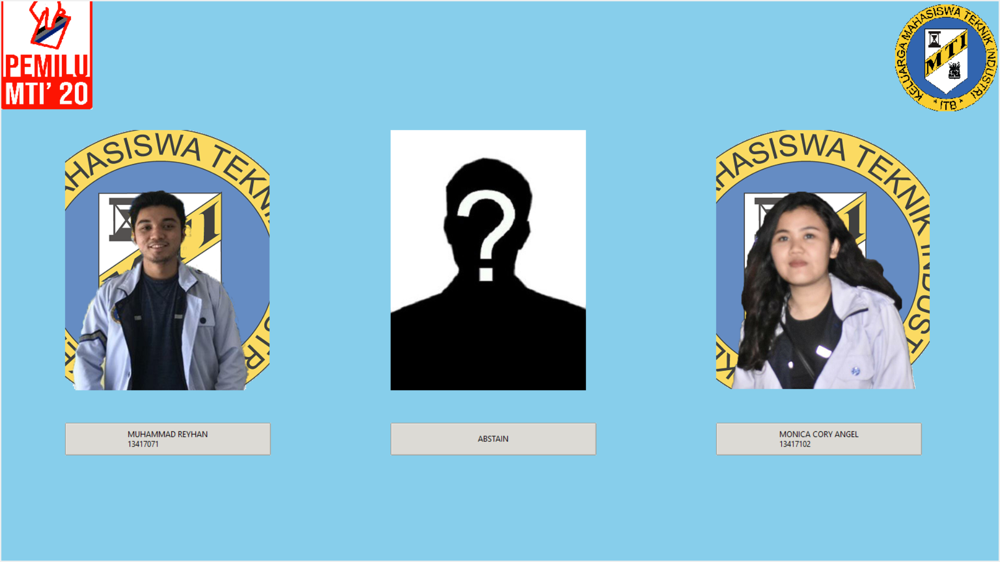

# Pemilu MTI

Aplikasi untuk pemilu

## Getting Started

Ini adalah aplikasi yang digunakan oleh Himpunan MTI saat memilih ketua himpunan periode 2020-2021. 
Aplikasi ini bisa berjalan di ubuntu, mac, ataupun windows.

### Prerequisites

1. Python. 
   ```
   Program ini ditulis menggunakan Python 2. Semua Python di atas versi Python 2.7 (termasuk Python 3) akan bisa menggunakan program ini. Harap diperhatikan untuk Ubuntu, Python 2 sudah terpasang secara default
   ```
2. Tkinter.
   ```
   Sebuah modul dasar untuk mengaktifkan GUI pada program Python
   ```

### Installing

1. Python (Silakan pilih salah satu saja versi Python yang diinginkan)
Untuk Python 3, gunakan command ini

```
sudo apt-get update
sudo apt-get install python3
```

Sementara untuk Python 2, gunakan command ini

```
sudo apt-get update
sudo apt-get install python
```
2. Tkinter

Untuk versi Python 3, gunakan command ini

```
sudo apt-get install python3-tk
```

Sementara untuk versi Python 2, gunakan command ini

```
sudo apt-get install python-tk
```


## Running the program

1. Eksekusi program dari terminal menggunakan cara berikut:
   A. Untuk Windows
   Cukup eksekusi run.bat

   B. Untuk Ubuntu dan Macintosh

   ```
   python pemiluMTI.py
   ```

2. Masukkan token panitia di terminal. Token ini dapat diubah di program python utama. 
   Token default: "pemiluskuy"

   Note: Token sebaiknya hanya diketahui oleh panitia

3. Saat sudah masuk ke layar utama, silakan pilih pilihan Anda
4. Semua data voting disimpan di CSV yang bernama "pemilu.csv"

## Screenshot



## Built With

* [Python](https://docs.python.org/3/) - Kode dasar
* [Tkinter](https://docs.python.org/2/library/tkinter.html) - GUI Dependency

## Author

* **Rehan Adi Satrya** - *13518061* - [rehanadi](https://github.com/rehanadi30)

## Acknowledgments

* For Bussiness enquiries, please contact to one of these:
1. Line : rehanadi30 (ID)
2. Email :  - rehanadi457@gmail.com (Main Email)
            - 13518061@std.stei.itb.ac.id (Students Email)
3. LinkedIn : [Click here to open Linked In](https://www.linkedin.com/in/rehan-adi/)
